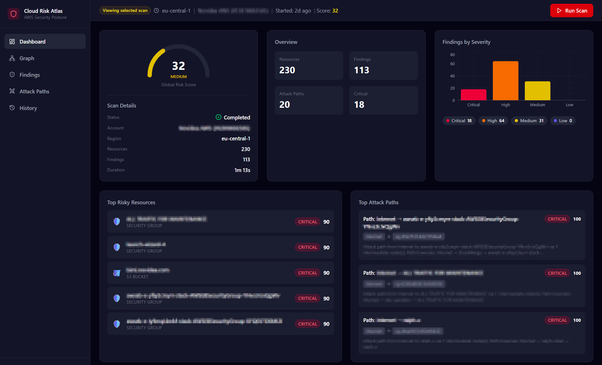
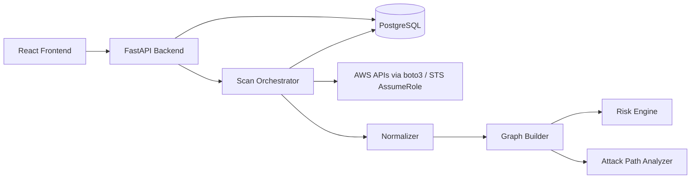

# Cloud Risk Atlas



Cloud Risk Atlas is an AWS cloud security posture project built to showcase practical DevOps and cloud security engineering skills. It scans one AWS account per scan target in one chosen region, normalizes infrastructure into a graph, calculates posture findings, and highlights attack paths through an interactive frontend.

## What It Does

- Triggers asynchronous posture scans for one AWS account and one AWS region, or for a selected subset of AWS Organization accounts in one AWS region
- Creates one scan record per target account; organization scans are fan-out orchestration, not a single merged scan
- Discovers single-account targets from local AWS profiles in `~/.aws/credentials` and `~/.aws/config`
- Collects infrastructure metadata from EC2, VPC, Security Groups, IAM, S3, and Lambda
- Normalizes resources into a directed graph with a virtual `INTERNET` node plus derived relationships between exposed resources and IAM identities
- Evaluates built-in posture findings, computes per-resource risk scores, and derives a scan-level summary
- Renders dashboard, graph, findings, attack paths, and scan history views in the React frontend

## Architecture



## DevOps Highlights

- Dockerized multi-service stack with `docker compose`
- Async backend pipeline with background execution and controlled organization-scan concurrency
- Cross-account scan support using `STS AssumeRole`
- Structured logging with `structlog`
- GitHub Actions CI for backend validation, backend unit tests, frontend lint, and frontend build
- Environment-driven configuration for local development and containerized execution

## Collected Services

- EC2 instances
- VPCs
- Security groups
- IAM roles
- S3 buckets
- Lambda functions

## Built-In Findings

- Security groups open to the world
- S3 buckets with public access
- S3 buckets without encryption
- IAM roles with wildcard permissions
- EC2 instances with public IP exposure
- Lambda functions attached to overly broad roles

## Graph Relationships

- `INTERNET -> EC2_INSTANCE` when an attached security group is open inbound
- `INTERNET -> S3_BUCKET` when the bucket is public
- `EC2_INSTANCE -> IAM_ROLE` when the instance profile ARN can be heuristically matched to a role name
- `LAMBDA_FUNCTION -> IAM_ROLE` through the execution role
- `IAM_ROLE -> S3_BUCKET` when the role has wildcard access and the graph derives a broad S3 reachability edge

## Scoring Model

- Resource risk score is the highest matching finding score plus `10%` of lower finding scores, capped at `100`
- Resource severity thresholds are `critical >= 80`, `high >= 60`, `medium >= 30`, `low > 0`
- Dashboard global risk score is the average risk score of non-`INTERNET` resources in the scan
- Attack-path score is the maximum resource score on the path plus a path-length bonus capped at `20`, then capped at `100`

## API Surface

- `GET /health`
- `GET /api/v1/aws/accounts`
- `GET /api/v1/aws/organization-accounts?profile=<profile>`
- `POST /api/v1/scans/trigger`
- `POST /api/v1/scans/trigger-organization`
- `GET /api/v1/scans/?limit=<n>&offset=<n>`
- `GET /api/v1/scans/{scan_id}`
- `DELETE /api/v1/scans/{scan_id}`
- `GET /api/v1/scans/{scan_id}/dashboard/`
- `GET /api/v1/scans/{scan_id}/graph/`
- `GET /api/v1/scans/{scan_id}/findings/?severity=<severity>&resource_id=<id>&limit=<n>&offset=<n>` returns a paginated payload with `items`, `total`, `limit`, `offset`, and `has_more`
- `GET /api/v1/scans/{scan_id}/findings/{finding_id}`
- `GET /api/v1/scans/{scan_id}/attack-paths/`

## Current Scope And Limits

This project is intentionally focused on cloud posture and attack-surface analysis, not full host vulnerability management.

Included today:
- Misconfiguration and exposure findings for the six built-in rules above
- Resource graphing and attack path modeling across the collected services above
- Selected-account organization scans in a single region per request
- Scan selection in the UI, including account name display when available

Planned future extensions:
- Amazon Inspector ingestion
- SSM inventory and patch compliance signals
- Host vulnerability and unsupported OS insights

Current limits:

- No agent-based host scanning
- No Amazon Inspector or SSM ingestion yet
- No scheduler or recurring scan orchestration
- No multi-region fan-out in a single request
- Attack-path search is heuristic, uses `networkx.all_simple_paths(..., cutoff=5)`, and returns the top `20` scored paths

## Stack

- Backend: FastAPI, SQLAlchemy Async, PostgreSQL, boto3, NetworkX
- Frontend: React, TypeScript, Vite, TanStack Query, Tailwind
- Runtime: Docker Compose
- CI: GitHub Actions

## Local Run

### Requirements

- Docker and Docker Compose
- AWS credentials available locally in `~/.aws`

### Setup

Copy `.env.example` to `.env` in the repository root and set at least `POSTGRES_PASSWORD`.

### Start

```bash
docker compose up --build
```

Frontend:
- `http://localhost:3001`

Backend:
- `http://localhost:8000`
- Health endpoint: `http://localhost:8000/health`

## AWS Organization Scans

To use organization scans, the selected profile must be able to:

- Call `organizations:DescribeOrganization`
- Call `organizations:ListAccounts`
- Assume a shared role in the selected member accounts

Behavior:

- The UI loads organization accounts from the selected management or delegated-admin profile
- You choose exactly which active accounts to scan
- The request runs in one region only
- Each selected account becomes its own scan record in history
- If the selected account is the source profile account, the scan runs without cross-account role assumption for that account

Default member-account role name:

```text
OrganizationAccountAccessRole
```

This can be overridden with `AWS_ORG_MEMBER_ROLE_NAME`.

## Configuration

Example environment values are in `.env.example`. For the Docker Compose flow, these values are read from the repository root `.env`.

Important variables:

- `POSTGRES_USER`
- `POSTGRES_PASSWORD`
- `POSTGRES_DB`
- `AWS_PROFILE`
- `AWS_DEFAULT_REGION`
- `AWS_ORG_MEMBER_ROLE_NAME`
- `ORG_SCAN_CONCURRENCY`
- `DATABASE_URL`
- `LOG_LEVEL`
- `SUPPRESS_HEALTHCHECK_ACCESS_LOGS`

## Validation

Backend checks:

```bash
cd backend
python -m compileall app
python -m unittest discover -s tests -p "test_*.py" -v
```

Frontend build:

```bash
cd frontend
npm install
npm run lint
npm run build
```

## Portfolio Notes

This repository demonstrates:

- Designing a cloud security scanner around AWS-native APIs
- Building a data pipeline from collection to normalization, graph analysis, and persistence
- Working with containerized local environments
- Shipping developer-friendly operational tooling like CI, health checks, and configuration management
- Making deliberate scope decisions instead of over-claiming unsupported security coverage

## Project Structure

```text
backend/
  app/
    api/
    collectors/
    services/
    rules/
    graph/
    normalizer/
frontend/
  src/
    pages/
    components/
    hooks/
.github/workflows/
```
